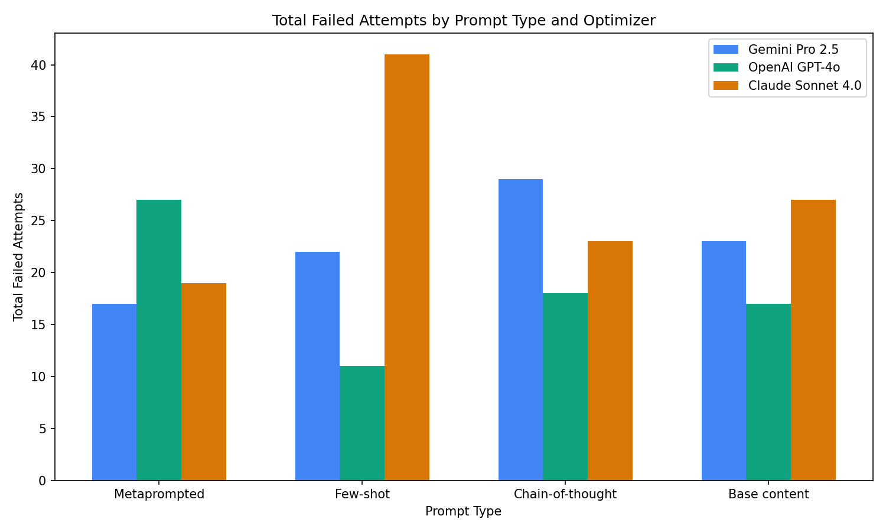
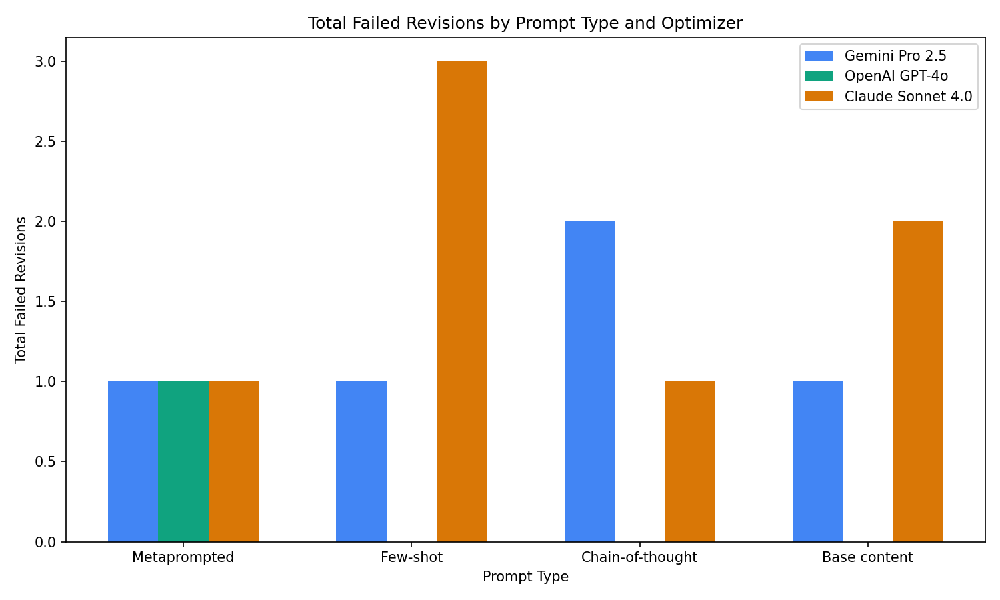

# An [MPCO](https://arxiv.org/pdf/2508.01443) recreation

1. API keys in `.env`, run `setup.py` for repo cloning (must do before `main.py`)

2. `main.py`

Results in `src/results.json`

## Configurations
Any combination of the following models
```
gemini-2.5-pro
4o-mini
claude-sonnet-4
```

and prompt techniques:
```
Simple prompting (Base)
CoT prompting
Few-Shot prompting
Meta-prompting (Experimental)
```

## Results

Preview with `MemoriLabs/Memori` and `nikopueringer/CorridorKey`

- **Average % Optimization :**  - averaged across 10 benchmarking trials


- **Average Runtime Diff :** How many seconds on average each revision reduced the test suite runtime by  


- **Failed Attempts :** # of times a model regenerated a revision after outputting faulty code (code that caused more tests to fail than the unrevised baseline)


- **Failed Revisions :** # of code snippets a configuration totally failed to output a valid revision for within 10 retries (no valid revision generated)


- **Total Tokens Used :** Average of total tokens used per configuration revision, including completion and prompt tokens


- **Average Significance and Cognitive Complexity :** Average of scores (1 - 5) awarded by 4o in Ragas with the following judge prompts:

For 'Significance' scoring:
```
Compare the optimized code (response) against the original code (user_input).
Evaluate whether the optimization is a significant, meaningful improvement or
merely rewrites the same logic differently. Score 1 if essentially the same logic
rewritten, 5 if it introduces genuinely better algorithms, data structures, or approaches.
```

For 'Cognitive Complexity' scoring:
```
Compare the optimized code (response) against the original code (user_input). 
Evaluate whether the optimized code maintains or improves cognitive complexity 
and maintainability. Consider nesting depth, cyclomatic complexity, readability, 
and code clarity. Score 1 if significantly harder to understand, 5 if significantly 
more readable and maintainable.
```

<p align="center">
  
  
</p>

<p align="center">
  
  
</p>

<p align="center">
  
  
</p>

<p align="center">
  
  
</p>

<p align="center">
  
</p>


## Analysis

- Meta-prompting did not yield significantly higher significance scores. It lowered cognitive complexity scores when using GPT-4o.

- Meta-prompting yielded the highest optimization % across all models. However, GPT-4o with 'Base' prompting gave the greatest optimizations.

- As expected, meta-prompting consumed more tokens in general.

- Meta-prompting AND revising with 4o appears to have greatly lowered the failed attempt count and made all revisions possible (0 failed revisions), suggesting that meta-prompting may be best when the same model is used for the meta-prompt as well as for the final generation.


## Assumptions & Constraints

- The developers' provided test suites & their runtimes were used to benchmark repositories, both optimized or unoptimized.
- The only evaluated metric in the original MPCO paper was runtime, so decreasing runtime was the primary (and singular) task.
- TurinTech's ARTEMIS was substituted for model calls to public APIs. 
- Claude Sonnet 3.7 was substituted for Sonnet 4.0.

`'37' -> '40'`

- Only repositories created after the latest training cutoff date of all 3 models (March 2025) were selected.

## Random Metaprompting Samples
1. Original:
   ```
   def search_facts(
    self,
    query: str,
    limit: int | None = None,
    entity_id: int | None = None,
    cloud: bool = False,
   ) -> list[RecallFact] | CloudRecallResponse:

    logger.debug(
        "Recall started - query: %s (%d chars), limit: %s",
        truncate(query, 50),
        len(query),
        limit,
    )
    if self.config.cloud:
        if self.config.entity_id is None:
            logger.debug("Recall aborted - no entity_id configured")
            return {"facts": []}

        logger.debug(
            "Recall started - query: %s (%d chars), limit: %s, cloud: true",
            truncate(query, 50),
            len(query),
            limit,
        )

        resolved_limit = self._resolve_limit(limit)
        response = self._search_with_retries_cloud(
            query=query, limit=resolved_limit
        )

        return self._filter_cloud_recall_response(response)

    if self.config.storage is None or self.config.storage.driver is None:
        logger.debug("Recall aborted - storage not configured")
        return []
   
    entity_id = self._resolve_entity_id(entity_id)
    if entity_id is None:
        return []

    limit = self._resolve_limit(limit)
    query_embedding = self._embed_query(query)
    return cast(
        list[FactSearchResult | Mapping[str, object] | str],
        self._search_with_retries(
            entity_id=entity_id,
            query=query,
            query_embedding=query_embedding,
            limit=limit,
        ),
    )
   ```
   Revised:
   ```
   def search_facts(
    self,
    query: str,
    limit: int | None = None,
    entity_id: int | None = None,
    cloud: bool = False,
   ) -> list[RecallFact] | CloudRecallResponse:
    query_len = len(query)
    truncated_query = truncate(query, 50)

    if self.config.cloud:
        if self.config.entity_id is None:
            logger.debug("Recall aborted - no entity_id configured")
            return {"facts": []}

        logger.debug(
            "Recall started - query: %s (%d chars), limit: %s, cloud: true",
            truncated_query,
            query_len,
            limit,
        )

        resolved_limit = self._resolve_limit(limit)
        response = self._search_with_retries_cloud(
            query=query, limit=resolved_limit
        )
        return self._filter_cloud_recall_response(response)

    logger.debug(
        "Recall started - query: %s (%d chars), limit: %s",
        truncated_query,
        query_len,
        limit,
    )

    if self.config.storage is None or self.config.storage.driver is None:
        logger.debug("Recall aborted - storage not configured")
        return []

    entity_id = self._resolve_entity_id(entity_id)
    if entity_id is None:
        return []

    resolved_limit = self._resolve_limit(limit)
    query_embedding = self._embed_query(query=query,
            query_embedding=query_embedding,
            limit=resolved_limit,
        ),
    )
   ```

2. Original
   ```
   async def augmentation_async(self, payload: dict) -> dict:
    url = self.url("sdk/augmentation")
    headers = self.headers()
    ssl_context = ssl.create_default_context(cafile=certifi.where())
    logger.debug("Sending augmentation request to %s", url)

    def _default_client_error_message(status_code: int) -> str:
        if status_code == 422:
            return (
                "Memori API rejected the request (422 validation error). "
                "Check your augmentation payload structure."
            )
        if status_code == 433:
            return (
                "The request was rejected (433). "
                "This can sometimes be caused by certificate/SSL inspection or proxy issues. "
                "If this persists, contact Memori Labs support via email at support@memorilabs.ai."
            )
        return f"Memori API request failed with status {status_code}."

    async def _read_error_payload(response: aiohttp.ClientResponse):
        try:
            data = await response.json()
        except Exception:
            return None, None

        if isinstance(data, dict):
            return data.get("message") or data.get("detail"), data
        return None, data

    async with aiohttp.ClientSession(
        connector=aiohttp.TCPConnector(ssl=ssl_context)
    ) as session:
        try:
            async with session.post(
                url,
                headers=headers,
                json=payload,
                timeout=aiohttp.ClientTimeout(total=30),
            ) as r:
                logger.debug("Augmentation response - status: %d", r.status)

                if r.status == 429:
                    logger.warning("Rate limit exceeded (429)")
                    if self._is_anonymous():
                        message, _data = await _read_error_payload(r)

                        if message:
                            raise QuotaExceededError(message)
                        raise QuotaExceededError()
                    else:
                        return {}

                if r.status == 422:
                    message, data = await _read_error_payload(r)
                    logger.error("Validation error (422): %s", message)
                    raise MemoriApiValidationError(
                        status_code=422,
                        message=message or _default_client_error_message(422),
                        details=data,
                    )

                if r.status == 433:
                    message, data = await _read_error_payload(r)
                    logger.error("Request rejected (433): %s", message)
                    raise MemoriApiRequestRejectedError(
                        status_code=433,
                        message=message or _default_client_error_message(433),
                        details=data,
                    )

                if 400 <= r.status <= 499:
                    message, data = await _read_error_payload(r)
                    logger.error("Client error (%d): %s", r.status, message)
                    raise MemoriApiClientError(
                        status_code=r.status,
                        message=message or _default_client_error_message(r.status),
                        details=data,
                    )

                r.raise_for_status()
                logger.debug("Augmentation request successful")
                return await r.json()
        except aiohttp.ClientResponseError:
            raise
        except (ssl.SSLError, aiohttp.ClientSSLError) as e:
            logger.error("SSL/TLS error during augmentation request: %s", e)
            raise MemoriApiError(
                "Memori API request failed due to an SSL/TLS certificate error. "
                "This is often caused by corporate proxies/SSL inspection. "
                "Try updating your CA certificates and try again."
            ) from e
        except (aiohttp.ClientError, asyncio.TimeoutError) as e:
            logger.error("Network/timeout error during augmentation request: %s", e)
            raise MemoriApiError(
                "Memori API request failed (network/timeout). "
                "Check your connection and try again."
            ) from e
   ```
   Revised:
   ```
   async def augmentation_async(self, payload: dict) -> dict:
    url = self.url("sdk/augmentation")
    headers = self.headers()
    timeout = aiohttp.ClientTimeout(total=30)
    session = getattr(self, '_aug_session', None)
    if session is None or session.closed:
        ssl_ctx = ssl.create_default_context(cafile=certifi.where())
        connector = aiohttp.TCPConnector(ssl=ssl_ctx)
        session = aiohttp.ClientSession(connector=connector)
        self._aug_session = session
    default_msgs = {
        422: "Memori API rejected the request (422 validation error). Check your augmentation payload structure.",
        433: "The request was rejected (433). This can sometimes be caused by certificate/SSL inspection or proxy issues. If this persists, contact Memori Labs support via email at support@memorilabs.ai."
    }
    async def read_error(response: aiohttp.ClientResponse):
        try:
            data = await response.json()
        except Exception:
            return None, None
        if isinstance(data, dict):
            return data.get("message") or data.get("detail"), data
        return None, data
    try:
        async with session.post(url, headers=headers, json=payload, timeout=timeout) as r:
            status = r.status
            logger.debug("Augmentation response - status: %d", status)
            if 400 <= status < 500:
                message, data = await read_error(r)
                if status == 429:
                    logger.warning("Rate limit exceeded (429)")
                    if self._is_anonymous():
                        if message:
                            raise QuotaExceededError(message)
                        raise QuotaExceededError()
                    return {}
                if status in (422, 433):
                    logger.error("%s error (%d): %s", 'Validation' if status == 422 else 'Request rejected', status, message)
                    exc = MemoriApiValidationError if status == 422 else MemoriApiRequestRejectedError
                    raise exc(
                        status_code=status,
                        message=message or default_msgs[status],
                        details=data,
                    )
                logger.error("Client error (%d): %s", status, message)
                raise MemoriApiClientError(
                    status_code=status,
                    message=message or default_msgs.get(status, f"Memori API request failed with status {status}."),
                    details=data,
                )
            r.raise_for_status()
            logger.debug("Augmentation request successful")
            return await r.json()
    except aiohttp.ClientResponseError:
        raise
    except (ssl.SSLError, aiohttp.ClientSSLError) as e:
        logger.error("SSL/TLS error during augmentation request: %s", e)
        raise MemoriApiError(
            "Memori API request failed due to an SSL/TLS certificate error. "
            "This is often caused by corporate proxies/SSL inspection. "
            "Try updating your CA certificates and try again."
        ) from e
    except (aiohttp.ClientError, asyncio.TimeoutError) as e:
        logger.error("Network/timeout error during augmentation request: %s", e)
        raise MemoriApiError(
            "Memori API request failed (network/timeout). "
            "Check your connection and try again."
        ) from e
   ```
   
3. Original:
   ```
   def __init__(self, path: str, asset_type: str) -> None:
    self.path = path
    self.type = asset_type  # 'sequence' or 'video'
    self.frame_count = 0
    self._calculate_length()
   ```
   Revised:
   ```
   def __init__(self, path: str, asset_type: str) -> None:
    d = self.__dict__
    d['path'] = path
    d['type'] = asset_type
    d['frame_count'] = 0
    self._calculate_length()
   ```
   
4. Original:
   ```
   @torch.inference_mode()
   def process_frame(
      self,
      image: np.ndarray,
      mask_linear: np.ndarray,
      refiner_scale: float = 1.0,
      input_is_linear: bool = False,
      fg_is_straight: bool = True,
      despill_strength: float = 1.0,
      auto_despeckle: bool = True,
      despeckle_size: int = 400,
      generate_comp: bool = True,
      post_process_on_gpu: bool = True,
     ) -> dict[str, np.ndarray] | list[dict[str, np.ndarray]]:
    """
    Process a single frame.
    Args:
        image: Numpy array [H, W, 3] or [B, H, W, 3] (0.0-1.0 or 0-255).
               - If input_is_linear=False (Default): Assumed sRGB.     
               - If input_is_linear=True: Assumed Linear.
        mask_linear: Numpy array [H, W] or [B, H, W] or [H, W, 1] or [B, H, W, 1] (0.0-1.0). Assumed Linear.
        refiner_scale: Multiplier for Refiner Deltas (default 1.0).    
        input_is_linear: bool. If True, resizes in Linear then transforms to sRGB.
                         If False, resizes in sRGB (standard).
        fg_is_straight: bool. If True, assumes FG output is Straight (unpremultiplied).
                        If False, assumes FG output is Premultiplied.  
        despill_strength: float. 0.0 to 1.0 multiplier for the despill effect.
        auto_despeckle: bool. If True, cleans up small disconnected components from the predicted alpha matte.
        despeckle_size: int. Minimum number of consecutive pixels required to keep an island.
        generate_comp: bool. If True, also generates a composite on checkerboard for quick checking.
        post_process_on_gpu: bool. If True, performs post-processing on GPU using PyTorch instead of OpenCV.
    Returns:
         dict: {'alpha': np, 'fg': np (sRGB), 'comp': np (sRGB on Gray)}
    """
    torch.compiler.cudagraph_mark_step_begin()

    # If input is a single image, add batch dimension
    if image.ndim == 3:
        image = image[np.newaxis, :]
        mask_linear = mask_linear[np.newaxis, :]

    bs, h, w = image.shape[:3]

    # 1. Inputs Check & Normalization
    image = TF.to_dtype(
        torch.from_numpy(image).permute((0, 3, 1, 2)),
        self.model_precision,
        scale=True,
    ).to(self.device, non_blocking=True)
    mask_linear = TF.to_dtype(
        torch.from_numpy(mask_linear.reshape((bs, h, w, 1))).permute((0, 3, 1, 2)),
        self.model_precision,
        scale=True,
    ).to(self.device, non_blocking=True)

    inp_t = self._preprocess_input(image, mask_linear, input_is_linear)

    # Free up unused VRAM in order to keep peak usage down and avoid OOM errors
    del image, mask_linear

    # 5. Inference
    # Hook for Refiner Scaling
    handle = None
    if refiner_scale != 1.0 and self.model.refiner is not None:        

        def scale_hook(module, input, output):
            return output * refiner_scale

        handle = self.model.refiner.register_forward_hook(scale_hook)  

    with torch.autocast(device_type=self.device.type, dtype=torch.float16, enabled=self.mixed_precision):
        prediction = self.model(inp_t)

    # Free up unused VRAM in order to keep peak usage down and avoid OOM errors
    del inp_t

    if handle:
        handle.remove()

    if post_process_on_gpu:
        out = self._postprocess_torch(
            prediction["alpha"],
            prediction["fg"],
            w,
            h,
            fg_is_straight,
            despill_strength,
            auto_despeckle,
            despeckle_size,
            generate_comp,
        )
    else:
        # Move prediction to CPU before post-processing
        pred_alpha = prediction["alpha"].cpu().float()
        pred_fg = prediction["fg"].cpu().float()

        out = []
        for i in range(bs):
            result = self._postprocess_opencv(
                pred_alpha[i],
                pred_fg[i],
                w,
                h,
                fg_is_straight,
                despill_strength,
                auto_despeckle,
                despeckle_size,
                generate_comp,
            )
            out.append(result)

    if bs == 1:
        return out[0]

    return out
    ```
   Revised:
   ```
   @torch.inference_mode()
   def process_frame(
    self,
    image: np.ndarray,
    mask_linear: np.ndarray,
    refiner_scale: float = 1.0,
    input_is_linear: bool = False,
    fg_is_straight: bool = True,
    despill_strength: float = 1.0,
    auto_despeckle: bool = True,
    despeckle_size: int = 400,
    generate_comp: bool = True,
    post_process_on_gpu: bool = True,
   ) -> dict[str, np.ndarray] | list[dict[str, np.ndarray]]:
    torch.compiler.cudagraph_mark_step_begin()

    if image.ndim == 3:
        image = image[np.newaxis, :]
        mask_linear = mask_linear[np.newaxis, :]

    bs, h, w = image.shape[:3]

    image_tensor = TF.to_dtype(
        torch.as_tensor(image, device=self.device).permute(0, 3, 1, 2),
        self.model_precision,
        scale=True,
    )

    if mask_linear.ndim == 3:
        mask_linear = mask_linear[..., np.newaxis]

    mask_tensor = TF.to_dtype(
        torch.as_tensor(mask_linear, device=self.device).permute(0, 3, 1, 2),
        self.model_precision,
        scale=True,
    )

    inp_t = self._preprocess_input(image_tensor, mask_tensor, input_is_linear)
    del image_tensor, mask_tensor

    handle = None
    if refiner_scale != 1.0 and self.model.refiner is not None:        
        def scale_hook(module, input, output):
            return output * refiner_scale
        handle = self.model.refiner.register_forward_hook(scale_hook)  

    with torch.autocast(
        device_type=self.device.type, dtype=torch.float16, enabled=self.mixed_precision
    ):
        prediction = self.model(inp_t)

    del inp_t

    if handle:
        handle.remove()

    if post_process_on_gpu:
        out = self._postprocess_torch(
            prediction["alpha"],
            prediction["fg"],
            w,
            h,
            fg_is_straight,
            despill_strength,
            auto_despeckle,
            despeckle_size,
            generate_comp,
        )
    else:
        pred_alpha = prediction["alpha"].cpu().float()
        pred_fg = prediction["fg"].cpu().float()
        out = [
            self._postprocess_opencv(
                pred_alpha[i],
                pred_fg[i],
                w,
                h,
                fg_is_straight,
                despill_strength,
                auto_despeckle,
                despeckle_size,
                generate_comp,
            )
            for i in range(bs)
        ]

    if bs == 1:
        return out[0]
    return out
   ```
5. Original:
   ```
   def _discover_checkpoint(ext: str) -> Path:
    """Find exactly one checkpoint with the given extension.

    Raises FileNotFoundError (0 found) or ValueError (>1 found).
    Includes cross-reference hints when wrong extension files exist.
    """
    matches = glob.glob(os.path.join(CHECKPOINT_DIR, f"*{ext}"))

    if len(matches) == 0:
        if ext == TORCH_EXT:
            return _ensure_torch_checkpoint()
        other_ext = MLX_EXT if ext == TORCH_EXT else TORCH_EXT
        other_files = glob.glob(os.path.join(CHECKPOINT_DIR, f"*{other_ext}"))
        hint = ""
        if other_files:
            other_backend = "mlx" if other_ext == MLX_EXT else "torch" 
            hint = f" (Found {other_ext} files — did you mean --backend={other_backend}?)"
        raise FileNotFoundError(f"No {ext} checkpoint found in {CHECKPOINT_DIR}.{hint}")

    if len(matches) > 1:
        names = [os.path.basename(f) for f in matches]
        raise ValueError(f"Multiple {ext} checkpoints in {CHECKPOINT_DIR}: {names}. Keep exactly one.")

    return Path(matches[0])
   ```
   Revised:
   ```
   from pathlib import Path

   def _discover_checkpoint(ext: str) -> Path:
    p = Path(CHECKPOINT_DIR)
    files = [f for f in p.iterdir() if f.is_file()]
    matches = [f for f in files if f.name.endswith(ext)]
    if not matches:
        if ext == TORCH_EXT:
            return _ensure_torch_checkpoint()
        other_ext = MLX_EXT if ext == TORCH_EXT else TORCH_EXT
        other_matches = [f for f in files if f.name.endswith(other_ext)]
        hint = ""
        if other_matches:
            other_backend = "mlx" if other_ext == MLX_EXT else "torch" 
            hint = f" (Found {other_ext} files — did you mean --backend={other_backend}?)"
        raise FileNotFoundError(f"No {ext} checkpoint found in {CHECKPOINT_DIR}.{hint}")
    if len(matches) > 1:
        names = [f.name for f in matches]
        raise ValueError(f"Multiple {ext} checkpoints in {CHECKPOINT_DIR}: {names}. Keep exactly one.")
    return matches[0]
   ```

## Setup

`{task_considerations}` : Algorithmic complexity and big O notation; data structures and their efficiency; loop optimizations and redundant iterations; memory access patterns and cache utilization; I/O operations and system calls; parallel processing and multi-threading; redundant computations.

`{4o_considerations}` : Focus on complex interdependencies and comprehensive optimization across the codebase, internally verify assumptions and performance metrics from the task description before proposing changes, consider memory and cache behavior vectorization and system level factors with thorough reasoning.

`{25_considerations}` : Apply complex reasoning to verify assumptions about performance metrics and project goals, think step by step to analyze bottlenecks evaluate trade offs and select the best strategy, provide only the final optimized code after internal reasoning.

`{40_considerations}` : Approach optimization with systematic architectural thinking, balance micro optimizations and broader structural improvements, provide clear rationale for each decision and prioritize maintainability.

`{task_description}` : Synthesize a single, best-runtime optimized version of the given object, preserving its signature.

`{Objective}` : Optimize the specific code object provided. Return ONLY the optimized version of that object, preserving its exact signature and interface.

Final prompts were assembled as follows:
```
{prompt}

Object to be optimized:

{snippet}

Enclosing scope of object:

{scope}
```

