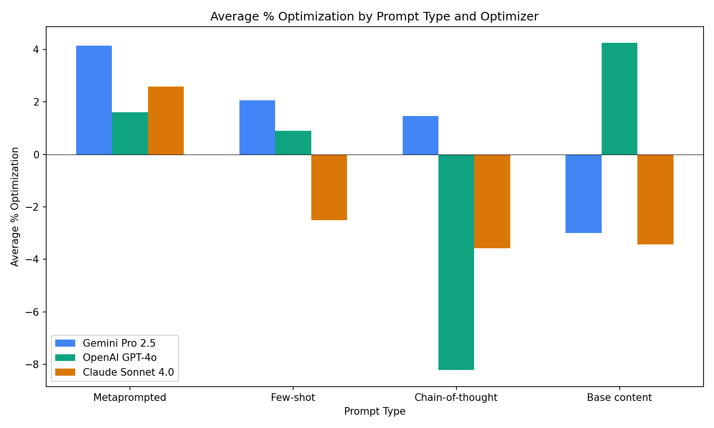
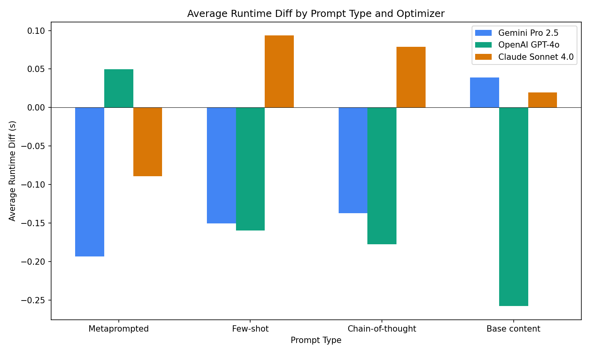
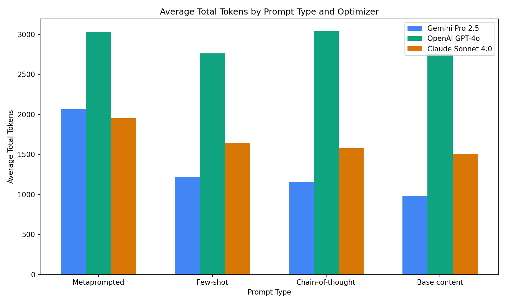
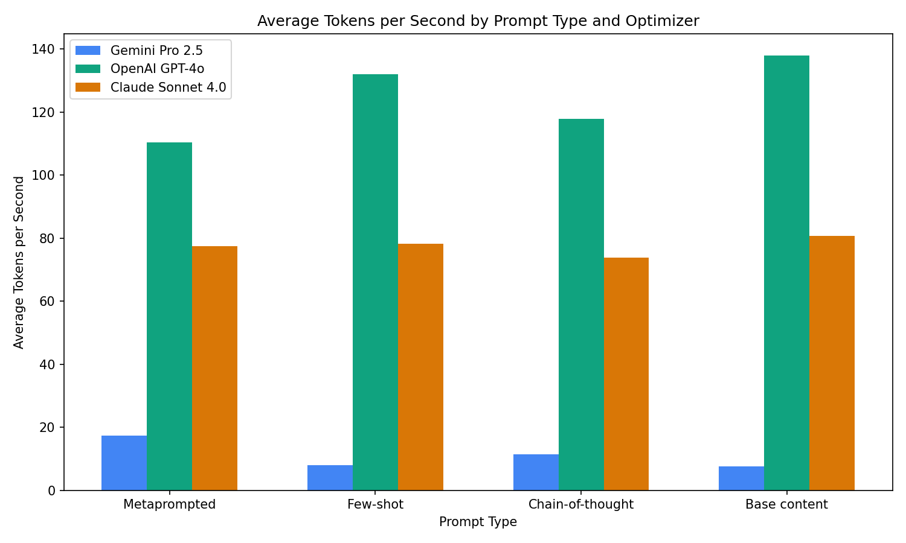
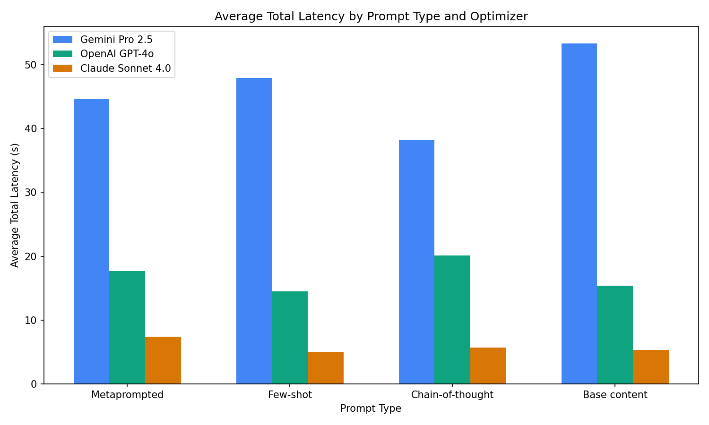
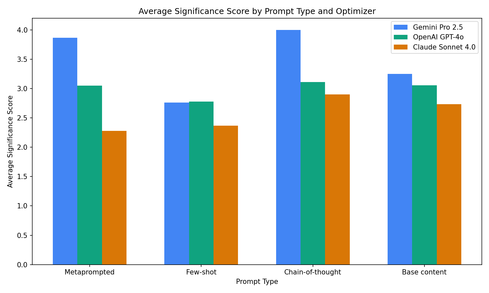
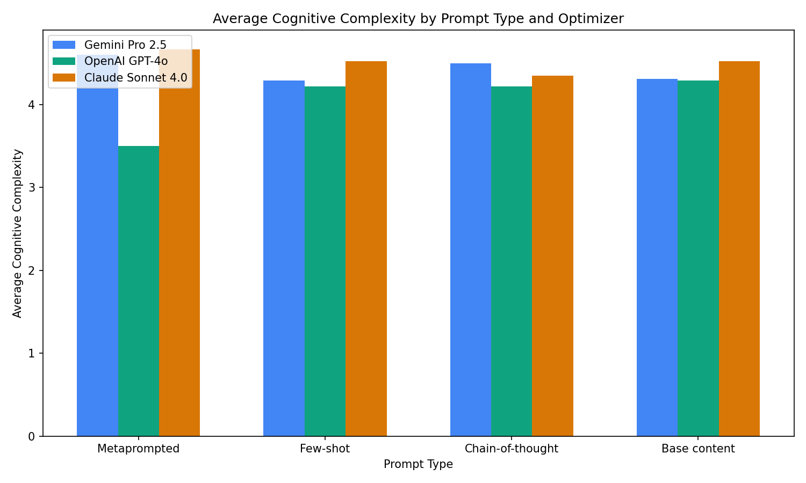

# An [MPCO](https://arxiv.org/pdf/2508.01443) recreation

1. API keys in `.env`, run `setup.py` for repo cloning (must do before `main.py`)

2. `main.py`

Results in `src/results.json`

## Configurations:
Any combination of the following models:
```
gemini-2.5-pro
o4-mini
claude-sonnet-4
```

And the following prompt techniques:
```
Simple prompting (Base)
CoT prompting
Few-Shot prompting
Meta-prompting (Experimental)
```

## Results

Preview with `MemoriLabs/Memori` and `nikopueringer/CorridorKey`

- **Average % Optimization :**  - averaged across 10 benchmarking trials


- **Average Runtime Diff :** How many seconds on average each revision reduced the test suite runtime by  


- **Failed Attempts :** # of times a model regenerated a revision after outputting faulty code (code that caused more tests to fail than the unrevised baseline)


- **Failed Revisions :** # of code snippets a configuration totally failed to output a valid revision for within 10 retries (no valid revision generated)


- **Total Tokens Used :** Average of total tokens used per configuration revision, including completion and prompt tokens


- **Average Significance and Cognitive Complexity :** Average of scores (1 - 5) awarded by o4 in Ragas with the following judge prompts:

For 'Significance' scoring:
```
Compare the optimized code (response) against the original code (user_input).
Evaluate whether the optimization is a significant, meaningful improvement or
merely rewrites the same logic differently. Score 1 if essentially the same logic
rewritten, 5 if it introduces genuinely better algorithms, data structures, or approaches.
```

For 'Cognitive Complexity' scoring:
```
Compare the optimized code (response) against the original code (user_input). 
Evaluate whether the optimized code maintains or improves cognitive complexity 
and maintainability. Consider nesting depth, cyclomatic complexity, readability, 
and code clarity. Score 1 if significantly harder to understand, 5 if significantly 
more readable and maintainable.
```

<p align="center">
  
  
</p>

<p align="center">
  
  
</p>

<p align="center">
  
  
</p>

<p align="center">
  
</p>

## Assumptions & Constraints

- The developers' provided test suites & their runtimes were used to benchmark repositories, both optimized or unoptimized.
- The only evaluated metric in the original MPCO paper was runtime, so decreasing runtime was the primary (and singular) task.
- TurinTech's ARTEMIS was substituted for model calls to public APIs. 
- Claude Sonnet 3.7 was substituted for Sonnet 4.0.

`'37' -> '40'`

#

`{task_considerations}` : Algorithmic complexity and big O notation; data structures and their efficiency; loop optimizations and redundant iterations; memory access patterns and cache utilization; I/O operations and system calls; parallel processing and multi-threading; redundant computations.

`{4o_considerations}` : Focus on complex interdependencies and comprehensive optimization across the codebase, internally verify assumptions and performance metrics from the task description before proposing changes, consider memory and cache behavior vectorization and system level factors with thorough reasoning.

`{25_considerations}` : Apply complex reasoning to verify assumptions about performance metrics and project goals, think step by step to analyze bottlenecks evaluate trade offs and select the best strategy, provide only the final optimized code after internal reasoning.

`{40_considerations}` : Approach optimization with systematic architectural thinking, balance micro optimizations and broader structural improvements, provide clear rationale for each decision and prioritize maintainability.

`{task_description}` : Synthesize a single, best-runtime optimized version of the given object, preserving its signature.

`{Objective}` : Optimize the specific code object provided. Return ONLY the optimized version of that object, preserving its exact signature and interface.

#

Prompts to the final models that committed the revisions were assembled as follows:

```
{prompt}

Object to be optimized:

{snippet}

Enclosing scope of object:

{scope}
```

# 
I don't think the results turned out the way it did in the paper for a few reasons:
1. Not having access to ARTEMIS meant that I was constrained in how I could prompt the models - I ended up needing to greatly emphasize the scope of each object and what I needed as the return, and the prompts I used turned out different as a result
   - I also needed to use json prompting, which likely occupied extra tokens and skewed the prompts
2. Testing may have been skewed due to benchmarking at different times or loads on my personal computer